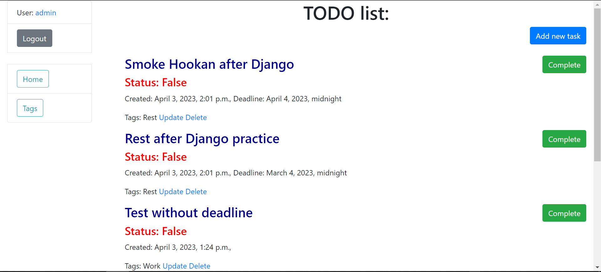
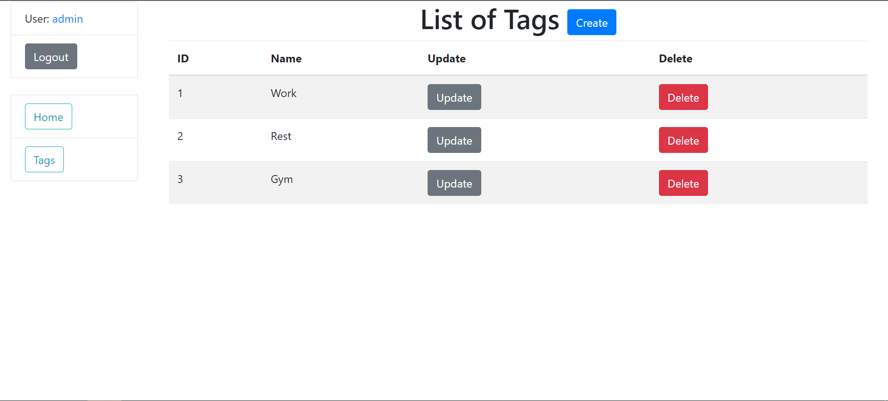
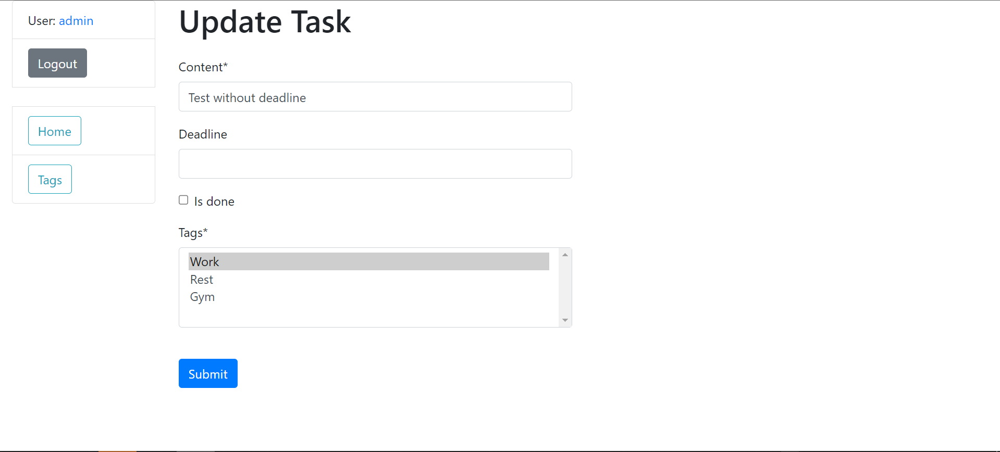
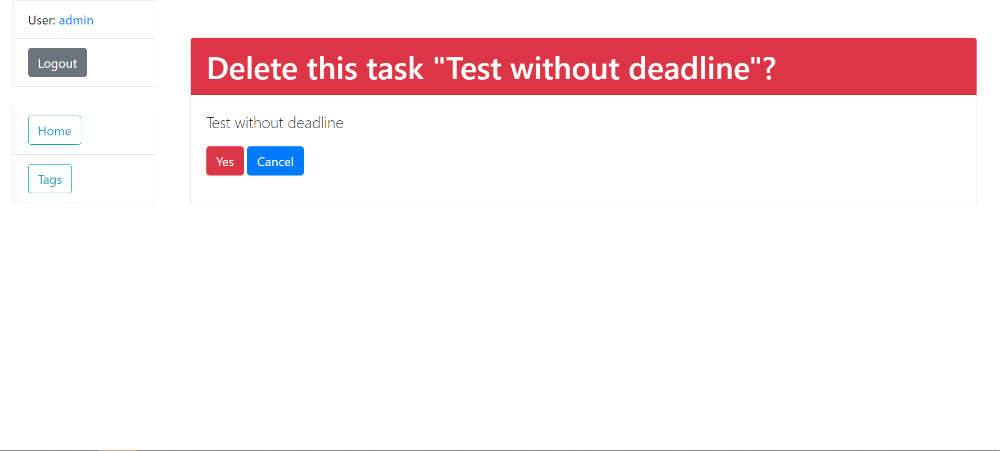

# TODO list
This project is a todo list site that allows users to create tasks with various details, including content, creation time, deadline, and tags. The site also allows users to mark tasks as done or not, and to add, edit, and delete tasks and tags.


## Installing / Getting started:
```shell
Python 3 must be installed
To get started, you need to clone the repository from GitHub: https://github.com/Morty67/Todo_list
cd restaurant-kitchen-service/
python -m venv venv
venv\Scripts\activate (on Windows)
source venv/bin/activate (on macOS)
pip install -r requirements.txt
python manage.py runserver
```
## Features:

*  Task creation
*  Task management
*  Tagging
*  Tag management
*  User interface

## Demo




